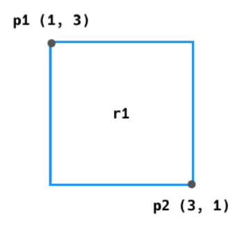

# :boom: Workshop

---

​			

## #. 도형 만들기

 아래의 명세를 읽고 Python 클래스를 활용하여 점(Point) 과 사각형(Rectangle)을 표현하시오.

Point 클래스에 대한 명세는 다음과 같다.

```python
인스턴스 변수   타입    설명
x              int    x 좌표
y              int    y 좌표

메서드: (생성자)
매개변수: x좌표, y좌표
변환값(타입): 없음
설명 : 인스턴스가 생성될 때, 전달 받은 int값들로 인스턴스 변수 x와 y를 초기화 한다.
   
예를 들어 좌표 (4,3)의 점은 아래와 같이 표현할 수 있다.
p1 = Point(4,3)
```

​				

Rectangle 클래스에 대한 명세는 다음과 같다.

```python
인스턴스 변수       타입              설명
p1           Point 인스턴스       좌측 상단 좌표
p2           Point 인스턴스       우측 하단 좌표

메서드: (생성자) , get_area , get_perimeter, is_square
매개변수: Point 인스턴스, Point 인스턴스, 없음 , 없음, 없음
변환값(타입): 없음, 넓이(int) , 둘레 길이(int) , 정사각형 유무(bool)
설명 : 인스턴스가 생성될 때, 2개의 Point 인스턴스를 전달 받아, 인스턴스 변수 p1과 p2를 초기화한다.
      사각형의 넓이를 계산하여 반환한다.
      사각형의 둘레 길이를 계산하여 반환한다.
      사각형이 정사각형이면 True, 아니면 False를 반환한다.
   
예를 들어 좌측 상단 좌표 (1,3)과 우측 하단 좌표(3,1)의 점으로 만든 사각형을 그림으로 표현 다음과 같다.
```



```python
p1 = Point(1,3)
p2 = Point(3,1)
r1 = Rectangle(p1, p2)
print(r1.get_area())
print(r1.get_perimeter())
print(r1.is_square())
p3 = Point(3, 7)
p4 = Point(6, 4)
r2 = Rectangle(p3, p4)
print(r2.get_area())
print(r2.get_perimeter())
print(r2.is_square())
```

```python
4
8
True
9
12
True
```

​						

```python
class Point:
    def __init__(self, x, y):
        self.x = x
        self.y = y       

class Rectangle(Point):
    def __init__(self, p1, p2):
        self.p1 = p1
        self.p2 = p2
        self.width = abs(self.p1.x-self.p2.x)
        self.height = abs(self.p1.y-self.p2.y)
    
    def get_area(self):
        return self.width * self.height

    def get_perimeter(self):
        return 2 * (self.width + self.height)

    def is_square(self):
        if self.width == self.height:
            return True
        else:
            return False
```

**4**

**8**

**True**

**9**

**12**

**True**

