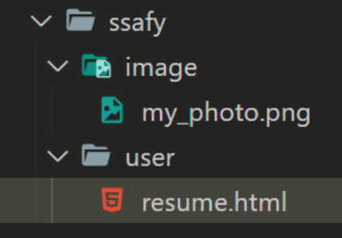

# :boom: Workshop

---

​																																	

## 1. img tag

아래 그림과 같은 폴더 구조가 있다. resume.html에서 코드를 작성 중일 때, image

폴더 안의 my_photo.png를 보여주는 img tag를 작성하시오.

단, 이미지가 제대로 출력되지 않을 때는 ssafy 문자열이 출력 되도록 작성하시오.




​									

```html

```

​																			

​																				

## 2. 파일 경로

위와 같이 경로를 __(a)__로 작성 할 시, github에 업로드 하거나 전체 폴더의 위치가 변경 되었을 때 

이미지를 불러 올 수 없게 된다. 이를 해결 하려면 이미지 경로를 __(b)__로 바꾸어 작성하면 된다.

__(a)__와 __(b)__에 들어갈 말과 __(b)__ 로 변경한 코드를 작성하시오.

​																								

```html
(a)     상대경로
(b)  절대경로
```

​																	

​																					

## 3. Hyper Link

 출력된 my_photo.png 이미지를 클릭하면 ssafy.com으로 이동하도록 하시오.

​																	

```html
<a href="ssafy.com"></a>
```

​																							

​																														

## 4. 선택자

​																								

1) 아래의 코드를 작성하고 결과를 확인하시오.

```html
<div id="ssafy">
   <h2>어떻게 선택 될까?</h2>
   <p>첫번째 단락</p>
   <p>두번째 단락</p>
   <p>세번째 단락</p> 
   <p>네번째 단락</p>
</div>
```

```html
#ssafy > p:nth-child(2) {
    color: red;
}
```

​																							

```html
p:nth-child = 부모안에 모든 요소 중 N번째 요소라는 의미이므로
첫번째 단락이 red로 바뀐다.

cf) :nth-child(2n+1) = 첫번째 요소부터 2번째 마다 선택
:nth-child(n+5) = 5번째 부터 모두 선택
:nth-child(odd) = 홀수 선택
:nth-child(even) = 짝수 선택
```

​																			

​															

2. nth-child를 nth-of-type으로 변경하고 결과를 확인하시오.

```html
#ssafy > p:nth-of-type(2) {
     color: blue;
}
```

​																	

```html
p:nth-of-type(n) = 부모안에 요소 중 n번째 p요소 선택이므로
두번째 단락이 red로 바뀐다.

cf) p:nth-of-type(2n+1) = 부모안에 p요소 중 첫번째부터 2번째마다 선택
※ :nth-child와 차이점은 모든 속성이 아닌 선택한 요소 중에서 선택을 한다.
```

​					