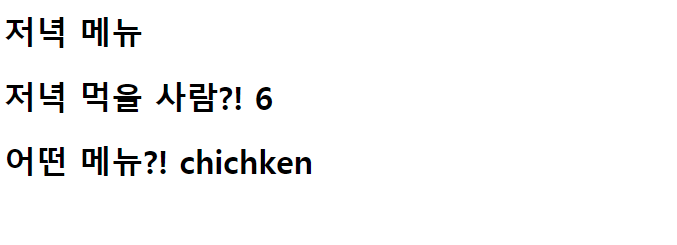

# :boom: Workshop

---

​																														



### 1. intro/urls.py

```python
from django.contrib import admin
from django.urls import path
from pages import views 

urlpatterns = [
    path('dinner/<int:number>/<str:menu>', views.dinner),
    path('admin/', admin.site.urls),
]
```

​																						

### 2. pages/views.py

```python
from django.shortcuts import render


# Create your views here.

def dinner(request, number, menu):
    number = 6
    menu = 'chichken'

    context = {
        'number': number,
        'menu': menu,
    }

    return render(request, 'dinner.html', context)
```

​																									

### 3. templates/dinner.html

```python
<!DOCTYPE html>
<html lang="en">
<head>
    <meta charset="UTF-8">
    <meta http-equiv="X-UA-Compatible" content="IE=edge">
    <meta name="viewport" content="width=device-width, initial-scale=1.0">
    <title>Document</title>
</head>
<body>
    <h1>저녁 메뉴</h1>
    <h1>저녁 먹을 사람?! {{ number }}</h1>
    <h1>어떤 메뉴?! {{ menu }}</h1>
</body>
</html>
```

