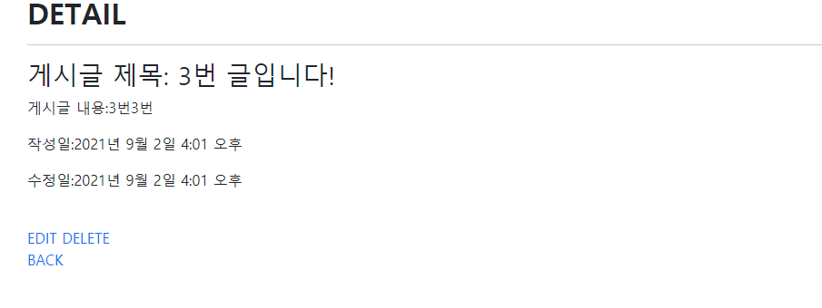

# :boom: Workshop

---

​																				

​																									

## 1. READ

​																										


```python



<h1 class="fw-bold">INDEX</h1>
<a href="" class="text-decoration-none">NEW</a>
<br>
<br>

<h3>글 제목: {{ article.title }}</h3>
<h4>글 내용: {{ article.content }}</h4>

<a href="" class="text-decoration-none">DETAIL</a>
<hr>



```

​									

## 2. Create

​																							


```python



<h1 class="fw-bold">NEW</h1>
<form action="" method="POST">
    
    <label for="title">TITLE:</label>
    <input type="text" id='title' name='title'><br><br>
    <label for="content">CONTENT:</label>
    <textarea name="content" id="content" cols="30" rows="10"></textarea><br>
    <input type="submit" value="작성">
</form>

<a href="" class="text-decoration-none">BACK</a>

```

​																									

## 3. DETAIL


```python



<h2 class="fw-bold">DETAIL</h2>
<hr>
<h3>게시글 제목: {{article.title}}</h3>
<p>게시글 내용:{{article.content}}</p>
<p>작성일:{{article.created_at}}</p>
<p>수정일:{{article.updated_at}}</p>
<br>
<div class="d-flex flex-row">
<a href="" class='btn btn-primary m-1' >EDIT</a>

<form action="" method='POST'>

<button class="btn btn-danger m-1">DELETE</button>
</form>
</div>
<br>
<a href="" class="text-decoration-none"> BACK </a>



def delete(request,pk):
    article= Article.objects.get(pk=pk)
    if request.method == 'POST':
        article.delete()
        return redirect('articles:index')
    else:
        return redirect('articles:detail', article.pk)

```

​																			

​					

```python



<h2 class="fw-bold">DETAIL</h2>
<hr>
<h3>게시글 제목: {{article.title}}</h3>
<p>게시글 내용:{{article.content}}</p>
<p>작성일:{{article.created_at}}</p>
<p>수정일:{{article.updated_at}}</p>
<br>

<a href="" class="text-decoration-none" >EDIT</a>

<a href="" class="text-decoration-none">DELETE</a>

<br>
<a href="" class="text-decoration-none"> BACK </a>



def delete(request,pk):
    article= Article.objects.get(pk=pk)    
    article.delete()
    
    return redirect('articles:index')
```


​									

## 4. Update

​													


```python



<h1 class="fw-bold">EDIT</h1>
<form action="" method="POST">
    
    <label for="title">TITLE:</label>
    <input type="text" id='title' name='title' value='{{ article.title}}'><br><br>
    <label for="content">CONTENT:</label>
    <textarea name="content" id="content" cols="30" rows="10">{{article.content}}</textarea><br>
    <input type="submit" value="수정">
</form>

<a href="" class="text-decoration-none">BACK</a>


```

​											

## 5. Delete

​					

```python
def delete(request,pk):
    article= Article.objects.get(pk=pk)
    if request.method == 'POST':
        article.delete()
        return redirect('articles:index')
    else:
        return redirect('articles:detail', article.pk)
```


