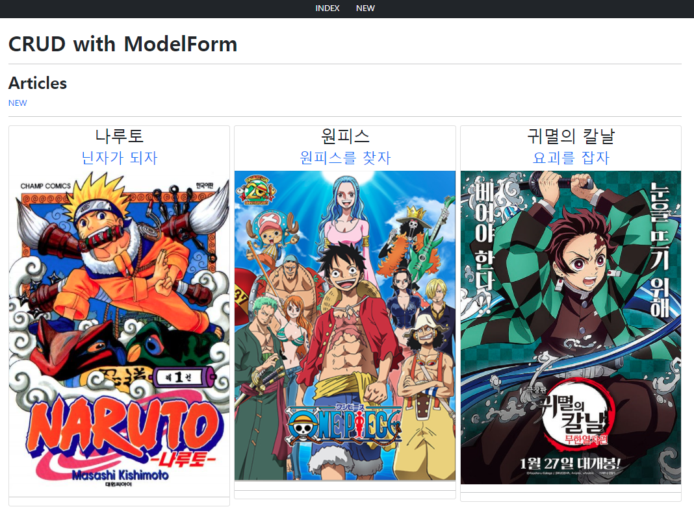
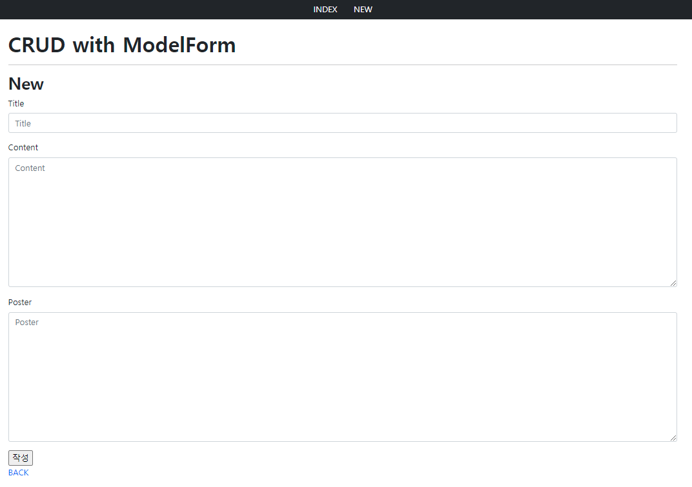
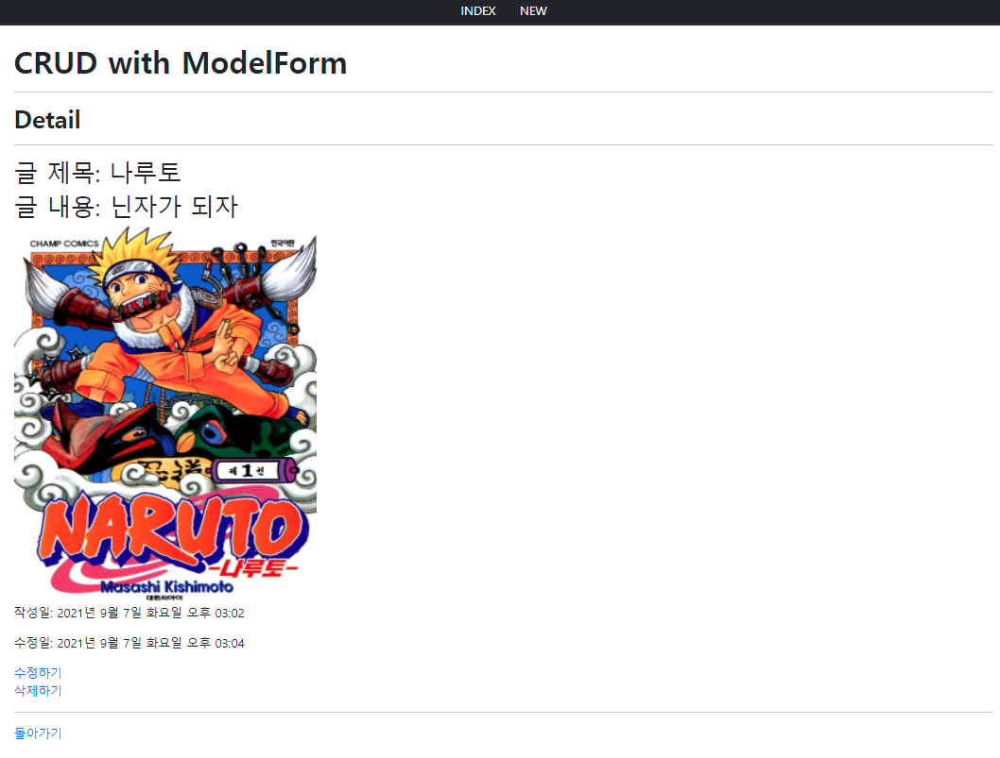
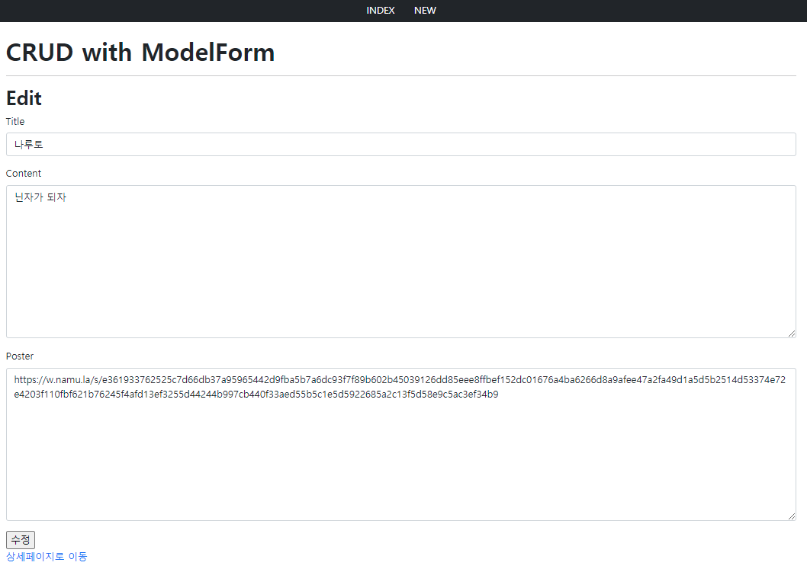

# :boom: Workshop

---

​																																																														

### 1. Read



```python




    <h2 class='fw-bold'>Articles</h2>
    <a href="" class='text-decoration-none'>NEW</a>
    <hr>
    <div class="row row-cols-1 row-cols-sm-2 row-cols-md-3 g-2">
        
        <div class="col">
            <div class="card text-center" >
                <h2 >{{article.title}}</h2>
                <a href="" class='text-decoration-none'><h3>{{article.content}}</h3></a>
                
                <hr>
            </div>
        </div>        
            
    </div>



#views
def index(request):
    articles = Article.objects.all()
    context = {
        'articles':articles,
    }
    return render(request, 'articles/index.html',context)
```

​																																						

### 2. Create



```python




<h2 class='fw-bold'>New</h2>
<form action=""method = 'POST'>
    
    
    <input type="submit" value="작성">
</form>
<a href="" class='text-decoration-none'>BACK</a>



#views
@require_http_methods(["GET", "POST"])
def create(request):
    if request.method =='POST':
        form = ArticleForm(request.POST)
        if form.is_valid():
            form.save()
            return redirect('articles:index')

    else:
        form = ArticleForm()
    context = {
        'form' : form,
    }
    return render(request, 'articles/create.html', context)
```

​																		

### 3. Detail




```python


    <h2 class='fw-bold'>Detail</h2>
    <hr>
    <h2>글 제목: {{article.title}}</h2>
    <h2>글 내용: {{article.content}}</h2>
    <a href="{{article.poster}}"></a>
    <p>작성일: {{article.created_at|date:'Y년 M j일 D A h:i'}}</p>
    <p>수정일: {{article.updated_at|date:'Y년 M j일 D A h:i'}}</p>
    <a href="" class='text-decoration-none'>수정하기</a> <br>
    <a href="" class='text-decoration-none'>삭제하기</a> <br>
    <hr>
    <a href="" class='text-decoration-none'>돌아가기</a>




#views
def detail(request, pk):
    article = Article.objects.get(pk=pk)

    context = {
        'article':article,
    }
    return render(request, 'articles/detail.html', context)
```

​																													

### 4. Update



```python




    <h2 class='fw-bold'>Edit</h2>
    <form action="" method='POST'>
        
        
        <input type="submit" value="수정">
    </form>

    <a href="" class='text-decoration-none'>상세페이지로 이동</a>



#views

def update(request, pk):
    article = Article.objects.get(pk=pk)

    if request.method == 'POST':
        form = ArticleForm(request.POST, instance=article)
        if form.is_valid():
            article = form.save()
            return redirect('articles:detail', article.pk)
    
    else:
        form = ArticleForm(instance=article)
    context = {
        'article': article,
        'form' : form,
    }
    return render(request, 'articles/update.html', context)
```

​																	

### 5. Delete

```python
def delete(request, pk):
    article = Article.objects.get(pk=pk)
    article.delete()

    return redirect('articles:index')
```

