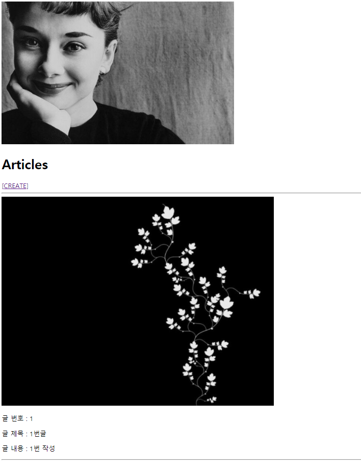

# :boom: Workshop

---

​															




​																	

### 1. index에 사진이 안나오는 문제 해결

```python
# settings.py에 추가 경로 작성

STATICFILES_DIRS = [
    BASE_DIR / 'static',
]
```

​																				

### 2. 이미지 업로드

```python
#create.html 수정

<body>
  <h1>CREATE</h1>
  <form action= method="POST" enctype="multipart/form-data">
    
    {{ form.as_p }}
    <input type="submit">
  </form>
</body>
</html>
```

​																

```python
#models.py 수정

class Article(models.Model):
    title = models.CharField(max_length=10)
    content = models.TextField()
    image = models.ImageField(blank=True, upload_to='images/' )
    created_at = models.DateTimeField(auto_now_add=True)
    updated_at = models.DateTimeField(auto_now=True)
```

​																							

```python
#프로젝트 urls.py 수정

from django.contrib import admin
from django.urls import path, include
from django.conf import settings
from django.conf.urls.static import static

urlpatterns = [
    path('admin/', admin.site.urls),
    path('articles/', include('articles.urls')),
] + static(settings.MEDIA_URL, document_root=settings.MEDIA_ROOT)
```


