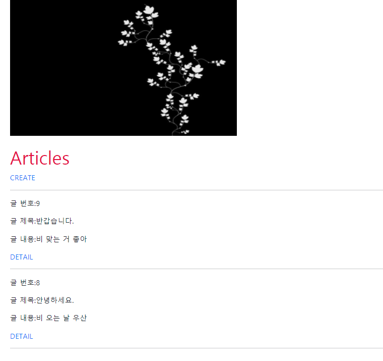
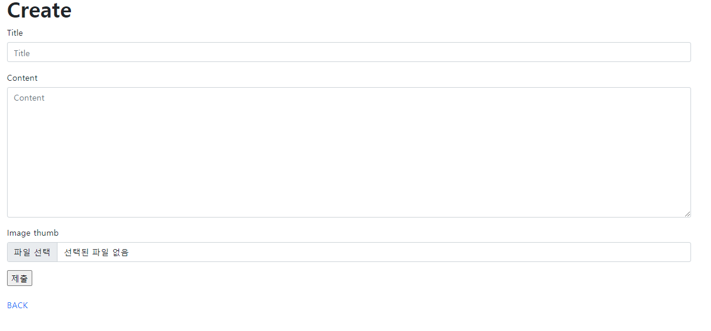
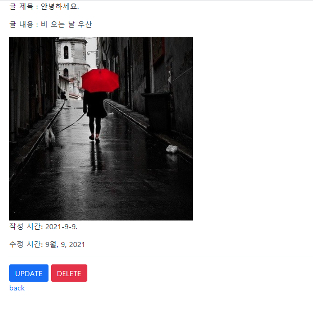
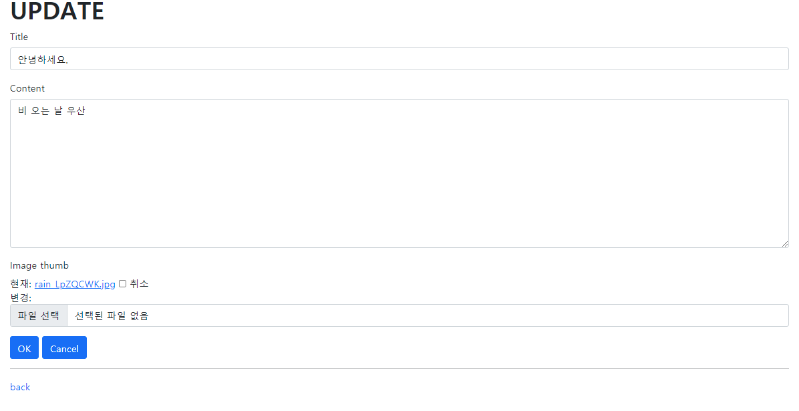

# :boom: Workshop

---

​																																																						

### 1. READ

​																																				



```python



    <link rel="stylesheet" href="">
   


    
<br>
<br>
<h1>Articles</h1>
<a href="" class='text-decoration-none'>CREATE</a>
<hr>

<p> 글 번호:{{article.pk}}</p>
<p> 글 제목:{{article.title}}</p>
<p> 글 내용:{{article.content}}</p>
<a href=""class='text-decoration-none'>DETAIL</a>
<hr>


       
```

​											

### 2. Create

​															



```python
#create.html




<h1 class='fw-bold'>Create</h1>
<form action=""method='POST' enctype='multipart/form-data'>
    
    
    <input type="submit" value="제출"> 
</form>
<br>
<a href="" class='text-decoration-none'>BACK</a>

```

```python
#views.py

def create(request):
    if request.method == 'POST':
        form = ArticleForm(request.POST, request.FILES)
        if form.is_valid():
            form.save()
            messages.add_message(request, messages.SUCCESS, '게시글이 작성되었습니다.')
            # messages.info(request,'게시글이 작성되었습니다.')
            return redirect('articles:index')
    else:
        form = ArticleForm()
    context = {
        'form' : form,
    }

    return render(request, 'articles/create.html', context)
```

​																											

### 3. Detail

​																			



```python
#detail.html




<p> 글 제목 : {{article.title}}</p>
<p> 글 내용 : {{article.content}}</p>



<p>작성 시간: {{ article.created_at|date:"SHORT_DATE_FORMAT" }}</p>
<p>수정 시간: {{ article.updated_at|date:"M, j, Y" }}</p>
<hr>
<a href="" class='btn btn-primary'>UPDATE</a>
<a href="" class='btn btn-danger'>DELETE</a> <br>
<a href="" class = 'text-decoration-none'>back</a>

```

​											

### 4. UPDATE

​																				



```python
#update.html




<h1 class='fw-bold'> UPDATE </h1>
<form action=""method='POST' enctype='multipart/form-data'>
    
    
    <input type="submit" value="OK" class='btn btn-primary'>
    <button class='btn btn-primary'><a href="" class='text-white text-decoration-none'>Cancel</a></button>
</form>
<hr>
<a href="" class='text-decoration-none'>back</a>


#view.py

def update(request,pk):
    article = Article.objects.get(pk=pk)
    if request.method == 'POST':
        form = ArticleForm(request.POST, request.FILES, instance=article)
        if form.is_valid():
            article = form.save()
            return redirect('articles:detail', article.pk)
    
    else:
        form = ArticleForm(instance=article)
    context = {
        'article': article,
        'form': form,
    }
    return render(request, 'articles/update.html', context)
```

​																							

### 5. Delete	

```python
def delete(request, pk):
    article = Article.objects.get(pk=pk)
    article.delete()
    # messages.add_message(request, messages.WARNING, '게시글이 삭제되었습니다.')
    messages.warning(request, '게시글이 삭제되었습니다.')
    return redirect('articles:index')							
```

​																	

​																				