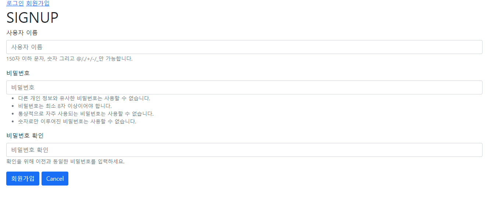

# :boom: Workshop

---


## Accounts CR


### 1. /accounts/

유저 목록을 출력하는 페이지를 나타낸다.

​						

```python
# accounts/index.html





    {{ user }}
    <br>
    <hr>



```

```python
#views.py
@require_safe # get 방식만
def index(request):
    users = User.objects.all()
    context = {
        'users':users,
    }
    return render(request, 'accounts/index.html', context)
```

​							

​						

### 2. /accounts/signup/

회원가입 작성을 위한 페이지를 나타낸다.

유저를 생성하는 기능을 수행한다.




```python
# accounts/signup.html




    <h1>SIGNUP</h1>
    <form action="" method="POST">
    
    
        
    </form>

```

```python
#views.py
@require_http_methods(['GET','POST'])
def signup(request):
    if request.user.is_authenticated:
        return redirect('accounts:index')
    if request.method == 'POST':
        form = UserCreationForm(request.POST)
        if form.is_valid():
            user = form.save()
            auth_login(request, user)
            return redirect('accounts:index')

    else:
        form = UserCreationForm()
    
    context ={
        'form':form,
    }
    return render(request, 'accounts/signup.html', context)
```

