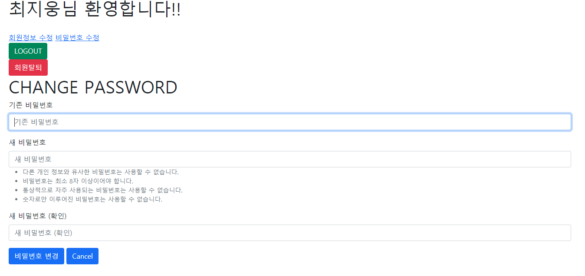

# :boom: Workshop

---


### 1. User Change Password

/accounts/password/형식의 url을 가지며, 유저의 비밀번호 수정 기능을 구현한다.

http://127.0.0.1:8000/accounts/password/



​														

```python
# change_password.html




    <h1>CHANGE PASSWORD</h1>
    <form action="" method="POST">
    
    
        
    </form>

```

```python
# views.py
@login_required
@require_http_methods(['GET','POST'])
def change_password(request):
    if request.method == 'POST':
        form = PasswordChangeForm(request.user, request.POST)
        if form.is_valid():
            user = form.save()
            update_session_auth_hash(request, user)
            return redirect('accounts:index')
    else:
        form = PasswordChangeForm(request.user)
    context = {
        'form':form,
    }
    return render(request, 'accounts/change_password.html',context)
```

​					

​																			

​																						
