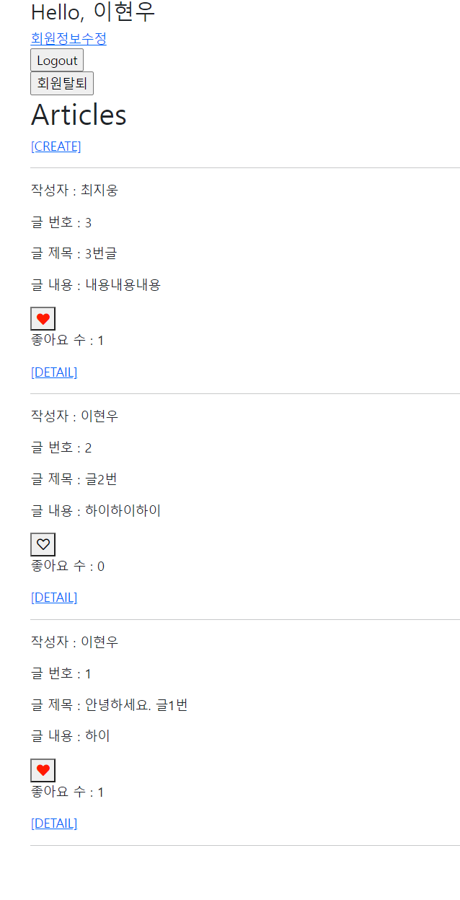

# :boom: Workshop

---


### Django Project





#### 1. Model

```python
class Article(models.Model):
    user = models.ForeignKey(settings.AUTH_USER_MODEL, on_delete=models.CASCADE)
    like_users = models.ManyToManyField(settings.AUTH_USER_MODEL,related_name='like_articles')
    title = models.CharField(max_length=10)
    title = models.CharField(max_length=10)
    content = models.TextField()
    created_at = models.DateTimeField(auto_now_add=True)
    updated_at = models.DateTimeField(auto_now=True)
# 여기서만 settings.AUTH_USER_MODEL 사용
# 나머지는 get_user_model()
    def __str__(self):
        return self.title
```


#### 2. url & view

```python
urlpatterns = [
    path('<int:article_pk>/likes/', views.likes, name='likes'),
]
```

```python
@require_POST
def likes(request, article_pk):
    if request.user.is_authenticated:
        article = get_object_or_404(Article, pk=article_pk)

        # 현재 좋아요를 요청하는 회원(request.user)이
        # 해당 게시글의 좋아요를 누른 회원 목록에 이미 있다면,
        if article.like_users.filter(pk=request.user.pk).exists():
        # if request.user in article.like_users.all(): 
            # 좋아요 취소
            article.like_users.remove(request.user)
        else:
            # 좋아요 하기
            article.like_users.add(request.user)
        return redirect('articles:index')
    return redirect('accounts:login')
```


#### 3. Template

```python
    <p>글 내용 : {{ article.content }}</p>
    <div>
      <form action="" method="POST">
        
        
          <button><i class="fas fa-heart" style="color:red"></i></button>
        
          <button><i class="far fa-heart" style="color:black"></i></button>
        
      </form>
      <p> 좋아요 수 : {{ article.like_users.count }}</p>
    </div>
```

