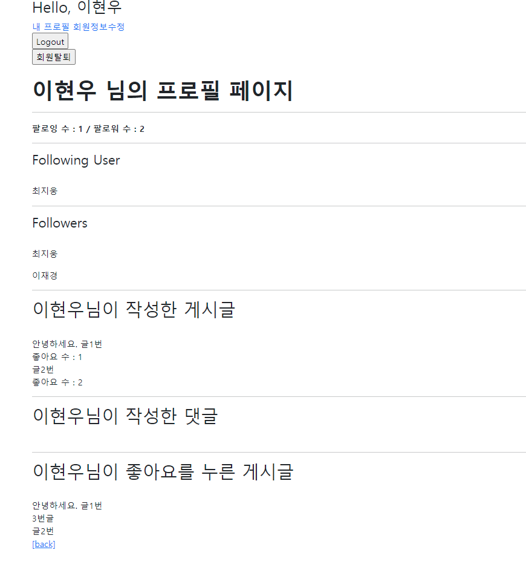

# :boom: workshop

---


### Django Project

데이터베이스 M:N 관계를 활용하여 팔로우 기능을 구현하시오.





​																									

### 1. Model & Form

```python
class User(AbstractUser):
    followings = models.ManyToManyField('self', symmetrical=False, related_name='followers')
    # 재귀, 자기자신에 대한 다대다 관계 'self'
    # symmetrical 대칭의 의미 내가 너를 팔로우하면 너도 나를 팔로우 해야되 같은 느낌
    # True 라면 자동으로 맞팔되는 시스템임
```

​																	

​																						

### 2. url & view

```python
# urls.py
urlpatterns = [
    path('<username>/', views.profile, name='profile'),
    path('<int:user_pk>/follow/', views.follow, name='follow'),  
]


#views.py

def profile(request, username):
    person = get_object_or_404(get_user_model(), username=username)
    context = {
        'person': person,
    }
    return render(request, 'accounts/profile.html', context)


@require_POST
def follow(request, user_pk):
    if request.user.is_authenticated:
        me = request.user
        you = get_object_or_404(get_user_model(), pk=user_pk)
        # person = get_object_or_404(get_user_model(), pk=user_pk)

        # 너와 내가 다른 사람이여야 팔로우를 진행할 수 있음
        # 나 자신은 팔로우해서는 안됨
        if me != you:
            # 내가 상대방(person)의 팔로워 목록에 있다면
            # if person.followers.filter(pk=request.user.pk).exists():
            if you.followers.filter(pk=me.pk).exists():
            # if request.user in person.followers.all():
            # 언팔로우
                you.followers.remove(me)
            else:
            # 팔로우
                you.followers.add(me)
        return redirect('accounts:profile', you.username)
    return redirect('accounts:login')

```

​																							

​																										

### 3. template

```python



  <h1 class= 'fw-bold'>{{ person.username }} 님의 프로필 페이지</h1>
  
    <hr>
    <div>
      <div class='fw-bold'>팔로잉 수 : {{ followings|length }} / 팔로워 수 : {{ followers|length }}</div>
      <hr>
       <h4> Following User </h4>
       <br>
      
       <p> {{ user.username }} </p>
      
      <hr>
       <h4> Followers </h4>
       <br>
      
       <p> {{ user.username }} </p>
      

    </div>
    
      <div>
        <form action="" method="POST">
          
          
            <input type="submit" value="언팔로우">
          
            <input type="submit" value="팔로우">
          
        </form>
      </div>
    
  

  <hr>

  <h2>{{ person.username }}님이 작성한 게시글</h2>
  <br>
  
    <div>
    {{ article.title }}
    <br>
        좋아요 수 : {{ article.like_users.count }}
    </div> 
  

  <hr>

  <h2>{{ person.username }}님이 작성한 댓글</h2>
  <br>
  
    <div>{{ comment.content }}</div>
  

  <hr>

  <h2>{{ person.username }}님이 좋아요를 누른 게시글</h2>
  <br>
  
    <div>{{ article.title }}</div>
  

  <a href="">[back]</a>
  

```

