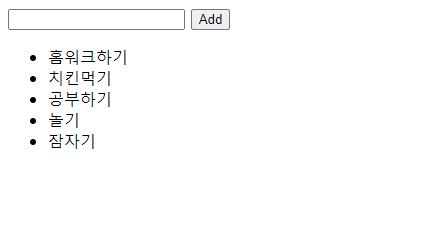

# :boom: Workshop

---





```html
<body>
    <form action="#">
        <input type="text">
        <button>Add</button>
    </form>

    <ul>

    </ul>


<script>
    
    const form = document.querySelector('form')

    const todo_app = function (event){
        event.preventDefault()
        
        const input = document.querySelector('input')
        const content = input.value

        if (content.trim()) {
            const liTag = document.createElement('li')
            liTag.innerText = content

            const ulTag = document.querySelector('ul')
            ulTag.appendChild(liTag)
        } else {
            alert('메세지를 입력하시오!!!!!!!!')
        }
        
        event.target.reset()
    }

    form.addEventListener('submit', todo_app)
</script>

</body>
```

