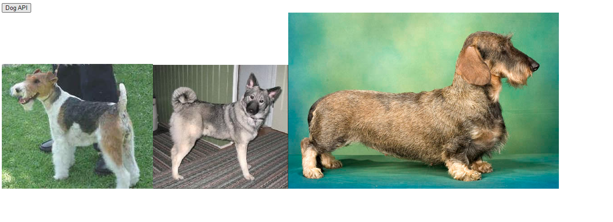

# :boom: Workshop

---


### Dog API




​																																																				

```javascript
<!DOCTYPE html>
<html lang="en">
<head>
    <meta charset="UTF-8">
    <meta http-equiv="X-UA-Compatible" content="IE=edge">
    <meta name="viewport" content="width=device-width, initial-scale=1.0">
    <title>Document</title>
</head>
<body>
    <button class='fw-bold'>Dog API</button>
    <div>

    </div>

    <script src="https://cdn.jsdelivr.net/npm/axios/dist/axios.min.js"></script>
    <script>
    const URL = 'https://dog.ceo/api/breeds/image/random'
    const mybtn = document.querySelector('button')

    mybtn.addEventListener('click',function() {
    axios.get(URL)
    .then(response => {
        return response.data
    })
    .then(response => {
        const IMGURL = response.message
        const NewimgTag = document.createElement('img')
        NewimgTag.src = IMGURL
        const dogbox = document.querySelector('div')
        dogbox.appendChild(NewimgTag)
    })
    .catch(error => {
        console.log(error)
    })
    })

    </script>
</body>
</html>
```

