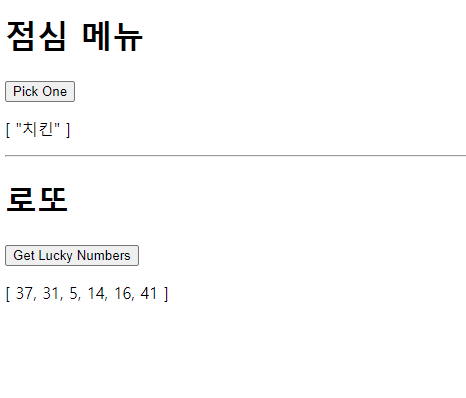

# :boom: Workshop

---


### 																				

```javascript
<!DOCTYPE html>
<html lang="en">
<head>
    <meta charset="UTF-8">
    <meta http-equiv="X-UA-Compatible" content="IE=edge">
    <meta name="viewport" content="width=device-width, initial-scale=1.0">
    <title>Document</title>
</head>
<body>
    <div id="app">
        <h1>점심 메뉴</h1>
        <button @click="menu">Pick One</button>
           <p>{{ message1 }}</p>
        
        <hr>
        
        <h1>로또</h1>
        <button @click="lotto">Get Lucky Numbers</button>
           <p>{{ message2 }}</p>
    </div>


    <script src="https://cdn.jsdelivr.net/npm/vue/dist/vue.js"></script>
    <script src="https://cdn.jsdelivr.net/npm/lodash@4.17.21/lodash.min.js"></script> 
    <script>
        const app = new Vue({
            el: '#app',
            data: {
                message1: "음식",
                message2: "숫자"
            },
            methods: {
                menu: function () {
                    const food = ["치킨", "피자", "햄버거", "김치찌개", "아이스크림"]
                    const randommenu = _.sampleSize(food, 1)
                    this.message1 = randommenu
                    
                },
                lotto: function (){
                    const numbers = _.range(1, 45)
                    const result = _.sampleSize(numbers, 6)
                    this.message2 = result
                }
                
            }
        })


    </script>

    
</body>
</html>
```

​																															

​																																					

