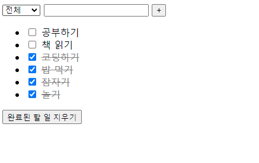

# :boom: Workshop

---


### 																				

```javascript
<!DOCTYPE html>
<html lang="en">
<head>
    <meta charset="UTF-8">
    <meta http-equiv="X-UA-Compatible" content="IE=edge">
    <meta name="viewport" content="width=device-width, initial-scale=1.0">
    <title>Document</title>
    <style>
        .completed {
            text-decoration: line-through;
            color: grey;
        }

    </style>
</head>
<body>
    <div id="app">
        <select v-model="status">
            <option value="all">전체</option>
            <option value="inProgress">진행중</option>
            <option value="completed">완료</option>
        </select>
        <input v-model="content" @keyup.enter="addTodo" type="text">
        <button @click="addTodo"> + </button>
        <br>
        <ul>
            <li v-for="todo in todolistByStatus" :key="todo.date">
                <input type="checkbox" :checked="todo.completed" @click="toggleTodo(todo)">
                <span :class="{ completed: todo.completed }">{{ todo.content }}</span>

            </li>
        </ul>
        <button @click="deleteCompleted">완료된 할 일 지우기</button>
    </div>


    <!-- vue.js-->
    <script src="https://cdn.jsdelivr.net/npm/vue/dist/vue.js"></script>
    <!-- Lodash-->
    <script src="https://cdn.jsdelivr.net/npm/lodash@4.17.21/lodash.min.js"></script>
    <script>
        const STORAGE_KEY = 'vue-todo-app'
        const todoStorage = {
            fetch: function () {
                return JSON.parse(localStorage.getItem(STORAGE_KEY)) || []  
            },
            save: function (todolist) {
                localStorage.setItem(STORAGE_KEY, JSON.stringify(todolist))
            }
        }
        
        const app = new Vue({
            el: '#app',
            data: {
                content: '',
                todolist: todoStorage.fetch(),
                status: 'all',
            },
            methods: {
                addTodo: function () {
                    const todo = {
                        content: this.content,      //할 일
                        completed: false,           // 완료여부
                        date: new Date().getTime(), //pk로 활용
                    }
                    this.todolist.push(todo)
                    this.content= ''
                },
                toggleTodo: function (todo) {
                    todo.completed = !todo.completed // true <-> false 뒤집기
                },
                deleteCompleted: function (){
                    this.todolist = this.todolist.filter(todo => !todo.completed)
                }
            },
            computed: {
                todolistByStatus: function () {
                    return this.todolist.filter(todo => {
                        if (this.status === "inProgress") {
                            return !todo.completed  // 해야할 일들에 해당하는 것만 보여줌
                        }
                        if (this.status === "completed") {
                            return todo.completed   // 완료된 일(todo.completed -> true)
                        }
                        return true                 // all 일때는 전부 보여줌
                    })
                }
            },
            watch: {
                todolist: {
                    handler: function (todolist) {
                        todoStorage.save(todolist)
                    },
                    deep: true,
                }
            }
        })

    </script>
    
</body>
</html>
```

​																															

​																																										

