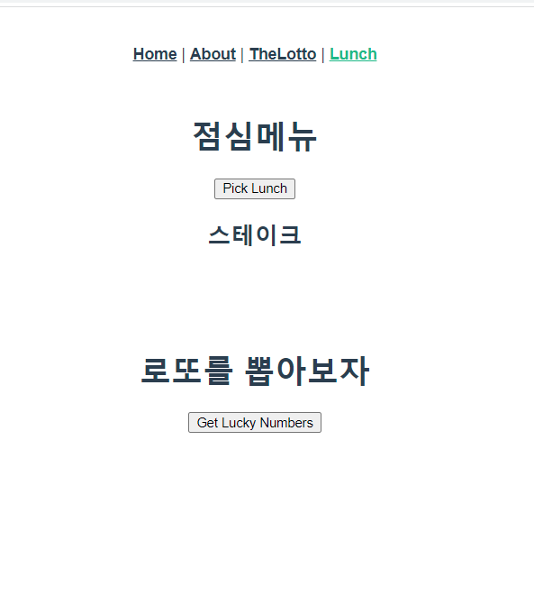
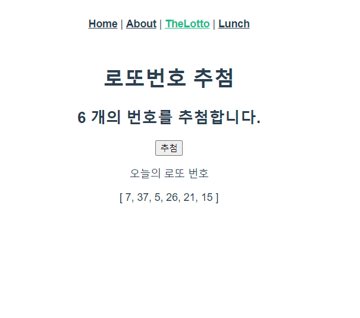

# :boom: Workshop

---







### index.js						

```javascript
import Vue from 'vue'
import VueRouter from 'vue-router'
import Home from '../views/Home.vue'
import About from '../views/About.vue'
import TheLotto from '../views/TheLotto.vue'
import Lunch from '../views/Lunch.vue'

Vue.use(VueRouter)

const routes = [
  {
    path: '/',
    name: 'Home',
    component: Home
  },
  {
    path: '/about',
    name: 'About',
    component: About
  },
  {
    path: '/lotto/:lottoNum',
    name: 'TheLotto',
    component: TheLotto,
  },
  {
    path: '/lunch',
    name: 'Lunch',
    component: Lunch,
  }
]

const router = new VueRouter({
  mode: 'history',
  base: process.env.BASE_URL,
  routes
})

export default router

```

​																																

​																																						

### Lunch.vue

```javascript
<template>
  <div>
      <h1>점심메뉴</h1>
      <button @click="getLunchMenu">Pick Lunch</button>
      <h2>{{ selectedLunch }}</h2>
      <br>
      <br>
      <br>

        <h1>로또를 뽑아보자</h1>
      <button @click="moveTheLotto">
          Get Lucky Numbers 
      </button>

  </div>
</template>

<script>
import _ from 'lodash'
export default {
    name: 'Lunch',
    data: function () {
        return {
            selectedLunch: '',
        }
    },
    methods: {
        getLunchMenu: function (){
            const menu = ['국밥','치킨','떡볶이','피자','삼겹살','굶기','찜닭','스테이크']
            this.selectedLunch = _.sample(menu)
        },
        moveTheLotto: function (){
            this.$router.push('/lotto/6')
        }
    }
}
</script>

<style>

</style>
```

​																													

### TheLotto.vue

```javascript
<template>
  <div>
      <h1>로또번호 추첨</h1>
      <h2>{{ $route.params.lottoNum }} 개의 번호를 추첨합니다.</h2>
      <button @click="getLuckyNum">추첨</button>
      <p>오늘의 로또 번호</p>
      <p>{{ selectedLuckyNum }}</p>

  </div>
</template>

<script>
import _ from 'lodash'
export default {
    name: 'TheLotto',
    data: function () {
        return {
            selectedLuckyNum: '',
        }
    },
    methods: {
        getLuckyNum: function (){
            const numbers = _.range(1, 46)
            this.selectedLuckyNum = _.sampleSize(numbers, this.$route.params.lottoNum)
        }
    }
}
</script>

<style>

</style>
```

​																								

### App.vue

```javascript
      <router-link to="/">Home</router-link> |
      <router-link to="/about">About</router-link> |
      <router-link :to="{ name: 'TheLotto', params: { lottoNum: 6} }">TheLotto</router-link> |
      <router-link :to="{ name: 'Lunch' }">Lunch</router-link> 
```

