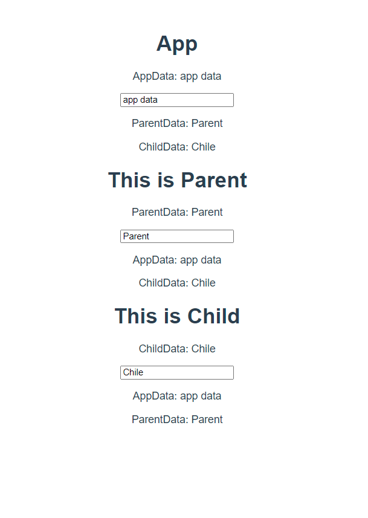

# :boom: Practice

---


### 																				

### App.vue

```vue
<template>
  <div id="app">
    <!-- 3. 사용한다. -->
    <h1>App</h1>
    <p>AppData: {{ appData }} </p>
    <input v-model="appData" type="text">
    <p>ParentData: {{ parentData}} </p>
    <p>ChildData: {{ childData}}</p>
    <Parent :appData="appData" 
    @parent-input="inputParent"
    @child-input="inputChild" />

  </div>
</template>

<script>
// 1. 불러온다.
import Parent from './components/Parent.vue'


export default {
  name: 'App',
  // 2. 등록한다.
  components: {
    Parent,

  },
  data: function () {
    return {
      appData: '',
      parentData: '',
      childData: '',
    }
  },
  methods: {
    inputParent: function(data) {
      this.parentData = data
    },
    inputChild: function(data) {
      this.childData = data
    }
  }
}
</script>

<style>
#app {
  font-family: Avenir, Helvetica, Arial, sans-serif;
  -webkit-font-smoothing: antialiased;
  -moz-osx-font-smoothing: grayscale;
  text-align: center;
  color: #2c3e50;
  margin-top: 60px;
}
</style>

```

​																																						

​																																

### Parent.vue

```vue
<template>
<div>
<!-- 하나의 컴포넌트에는 하나의 태그만 있어야한다. -->
  <h1>This is Parent</h1>
  <p>ParentData: {{ parentData }}</p>
  <input v-model="parentData" type="text" @input="inputParentData">
  <p>AppData: {{ appData }} </p>
  <p>ChildData: {{ childData }} </p>
  <Child :appData="appData" :parentData="parentData"
  @child-input="inputChildData"/>
</div>
</template>

<script>
import Child from './Child.vue'

export default {
    name: 'Parent',
    data: function () {
        return {
            parentData: '',
            childData: '',
        }
    },
    methods: {
        inputChildData: function (data) {
            this.childData = data
            this.$emit('child-input', this.childData)
            // console.log('!!! text from child')
        },
        inputParentData: function () {
            this.$emit('parent-input', this.parentData)
        }
    },
    props: {
        appData: String,
    },

    components: {
        Child,
    }

}
</script>

<style>

</style>
```

​																																			

​																																																																																

### Child.vue

```vue
<template>
  <div>
      <h1>This is Child</h1>
      <p>ChildData: {{ childData}} </p>
      <input v-model="childData" type="text" @input="inputChildData">
      <p>AppData: {{ appData }}</p>
      <p>ParentData: {{ parentData }}</p>
  </div>

</template>

<script>
export default {
    name: 'Child',
    data: function () {
        return {
            childData: ''
        }
    },
    methods: {
        inputChildData: function () {
            this.$emit('child-input', this.childData)
        } // 두번째 인자는 payload에 데이터가 담긴다.
    },
    props: {
        appData: String,
        parentData: String,
    }
}
</script>

<style>

</style>
```

​																																					

​																									

​																																					

