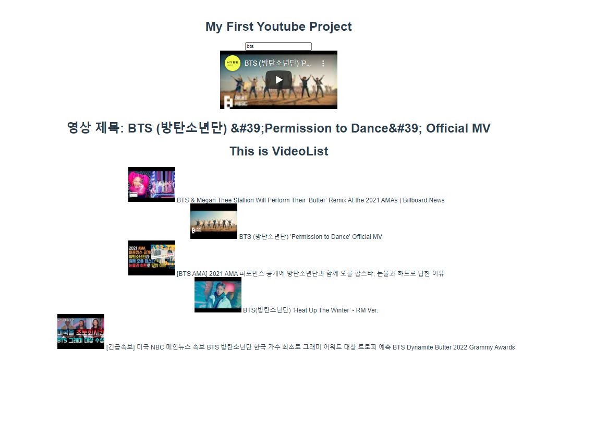

# :boom: Workshop

---


### App.vue

```vue
<template>
  <div id="app">
    <h1>My First Youtube Project</h1>
    <SearchBar @input-search="onInputSearch"/>
    <VideoDetail :video="selectedVideo" />
    <VideoList :videos="videos" @select-video="onVideoSelect"/>
    


  </div>
</template>

<script>
import axios from 'axios'
import SearchBar from '@/components/SearchBar'
// import SearchBar from './components/searchBar.vue'
import VideoList from '@/components/VideoList'
import VideoDetail from '@/components/VideoDetail'

const API_KEY = process.env.VUE_APP_YOUTUBE_API_KEY
const API_URL = 'https://www.googleapis.com/youtube/v3/search'

export default {
  name: 'App',
  components: {
    SearchBar,
    VideoList,
    VideoDetail,
  },
  data: function () {
    return {
      inputValue: '',
      videos: [],
      selectedVideo: '',
    }
  },
  methods: {
    onVideoSelect: function(video) {
      this.selectedVideo = video
    },
    onInputSearch: function(inputText) {
      // console.log('데이터가 searchBar로부터 올라옴')
      // console.log(inputText)
      this.inputValue = inputText

      const params = {
        key: API_KEY,
        part: 'snippet',
        type: 'video',
        q: this.inputValue,
      }
      axios.get(API_URL,{
        params, 
      })
      .then((res) => {
        // console.log(res.data.items)
        this.videos = res.data.items
        if(!this.selectedVideo) {
          this.selectedVideo = this.videos[0]
        }
      })
      .catch((err) => {
        console.log(err)
      })
    }
  }
}
</script>

<style>
#app {
  font-family: Avenir, Helvetica, Arial, sans-serif;
  -webkit-font-smoothing: antialiased;
  -moz-osx-font-smoothing: grayscale;
  text-align: center;
  color: #2c3e50;
  margin-top: 60px;
}
</style>

```

​																															

​																										

### SearchBar.vue																															

```vue
<template>
  <div>
      <input @keypress.enter="onInputKeyword" type="text">
  </div>
</template>

<script>
export default {
    name: 'SearchBar',
    methods: {
        onInputKeyword: function (event) {
            // console.log(event.target.value)
            this.$emit('input-search', event.target.value)
            // this.$emit('input-search', event.target.value, 'additional payload')  더 보내고 싶으면 더 넣으면됨
        }
    }
}
</script>

<style>

</style>
```

​													

### VideoList.vue																															

```vue
<template>
  <div>
    <h1>This is VideoList</h1>
    <ul>
        <!-- <li v-for="(video, index) in videos" :key="index">
            {{ video.snippet.title }}
        </li> -->
        <VideoListItem 
        v-for="(video, idx) in videos" :key="idx" :video="video"
        @select-video="onSelectVideo" />
    </ul>
  </div>
</template>

<script>
import VideoListItem from '@/components/VideoListItem'

export default {
    name: 'VideoList',
    methods: {
        onSelectVideo: function(video) {
            this.$emit('select-video', video)
        }
    },
    components: {
        VideoListItem
    },
    props: {
        videos: Array,
    }
}
</script>

<style>

</style>
```

​													

### VideoListitem.vue																															

```vue
<template>
  <li @click="selectVideo">
      
      {{ video.snippet.title | stringUnescape }}
  </li>
</template>

<script>
import _ from 'lodash'

export default {
 name: 'VideoListItem',
 methods: {
     selectVideo: function(){
        this.$emit('select-video', this.video)
     }
 },
 props: {
     video: {
         type: Object,
     }
 },
 computed: {
     youtubeImageSrc: function() {
         return this.video.snippet.thumbnails.default.url
     }
 },
 filters: {
     stringUnescape: function (rawText) {
         return _.unescape(rawText)
     } 
 }
}
</script>

<style>

</style>
```

​																					

### VideoDetail.vue																															

```vue
<template>
  <div v-if="video">
      <iframe :src="videoURL" frameborder="0"></iframe>

      <h1>영상 제목: {{video.snippet.title}}</h1>
      
  </div>
</template>

<script>
export default {
    name: "VideoDetail",
    props: {
        video: {
            type: [String, Object]   // 처음에 아무것도 안고른 경우
        }
    },
    computed: {
        videoURL: function() {
            const videoId = this.video.id.videoId
            return `https://www.youtube.com/embed/${videoId}`
        }
    }
}
</script>

<style>

</style>
```

​													
